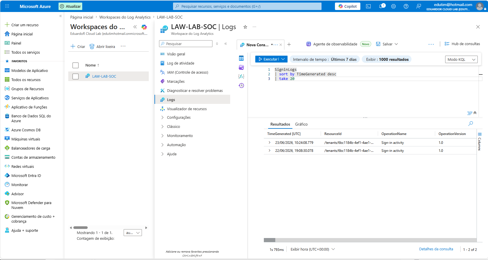
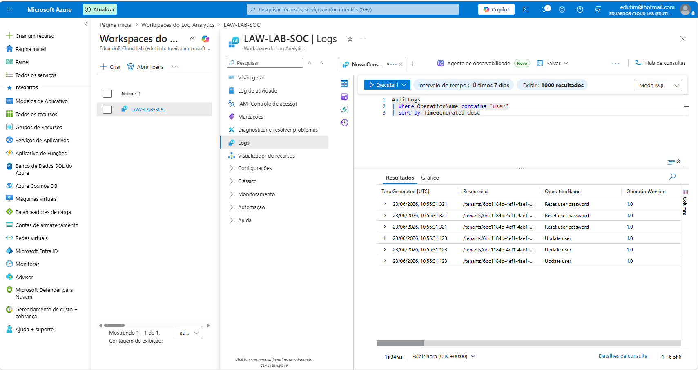
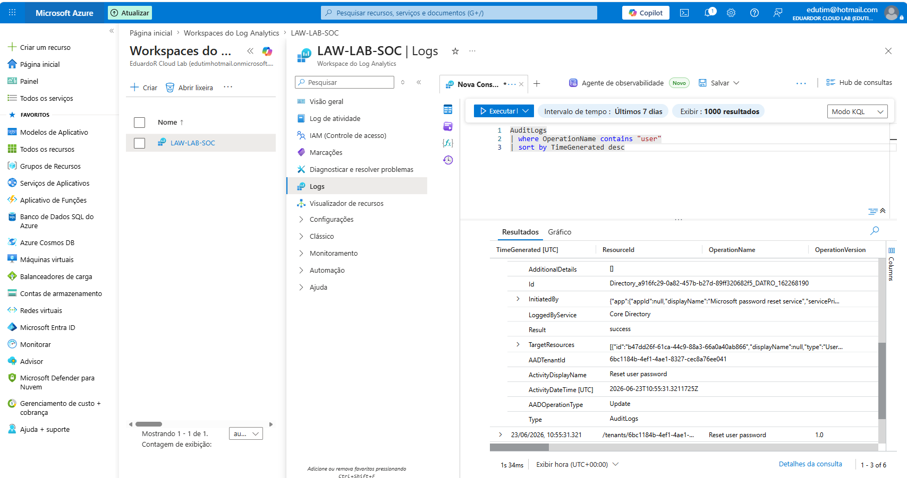

# Azure IAM Monitoring Lab with Microsoft Sentinel

   

## Overview

This project demonstrates a practical identity monitoring lab using Microsoft Azure, Microsoft Entra ID, Log Analytics Workspace, Microsoft Sentinel and KQL.

The goal was to simulate a basic corporate identity environment, generate administrative events, send logs to Log Analytics, and investigate them using Kusto Query Language.

## Technologies Used

- Microsoft Entra ID
- Azure Role-Based Access Control (RBAC)
- Log Analytics Workspace
- Microsoft Sentinel
- Azure Diagnostic Settings
- Kusto Query Language (KQL)

## Lab Scenario

A fictitious company environment was created to simulate identity and access management activities.

Users created:

- João Silva
- Maria Souza
- Carlos Lima

Security groups created:

- Financeiro
- RH
- TI

RBAC was configured by assigning the Reader role to the TI group at the Resource Group level.

## Architecture

```text
Microsoft Entra ID
        │
        ▼
 Users & Groups
        │
        ▼
 Diagnostic Settings
        │
        ▼
 Log Analytics Workspace
        │
        ▼
 Microsoft Sentinel
        │
        ▼
 KQL Investigation
```

## Activities Performed

- Created users in Microsoft Entra ID
- Created security groups
- Assigned users to groups
- Configured Azure RBAC
- Created a Log Analytics Workspace
- Enabled Microsoft Sentinel
- Configured Diagnostic Settings
- Sent SignInLogs and AuditLogs to Log Analytics
- Investigated password reset events using KQL

## KQL Queries

### Sign-in activity

```kusto
SigninLogs
| sort by TimeGenerated desc
| take 20
```

### User-related audit events

```kusto
AuditLogs
| where OperationName contains "user"
| sort by TimeGenerated desc
```

### Password-related audit events

```kusto
AuditLogs
| where OperationName contains "password"
| sort by TimeGenerated desc
```

## Evidence

### Sign-in Logs



### User Audit Logs



### Audit Event Details



## Investigation Summary

A password reset event for the user Maria Souza was investigated.

The following fields were analyzed:

- InitiatedBy
- TargetResources
- Result
- ActivityDisplayName
- ActivityDateTime

The investigation confirmed that the administrative action was successfully logged and could be reviewed through Log Analytics using KQL.

## Skills Demonstrated

- Identity and Access Management (IAM)
- Azure RBAC
- Azure Monitoring
- Microsoft Sentinel
- Log Analytics
- KQL Querying
- Audit Log Investigation
- Cloud Security Fundamentals

## Outcome

This lab demonstrates the ability to configure identity monitoring in Azure, collect security-relevant logs, and perform basic investigation using Microsoft Sentinel and KQL.

## Author

**Eduardo Rodrigues**  

Cloud Infrastructure | Azure | IAM | Security Monitoring

- GitHub: https://github.com/eduardoordg
- LinkedIn: https://www.linkedin.com/in/eduardoorodrigues/
